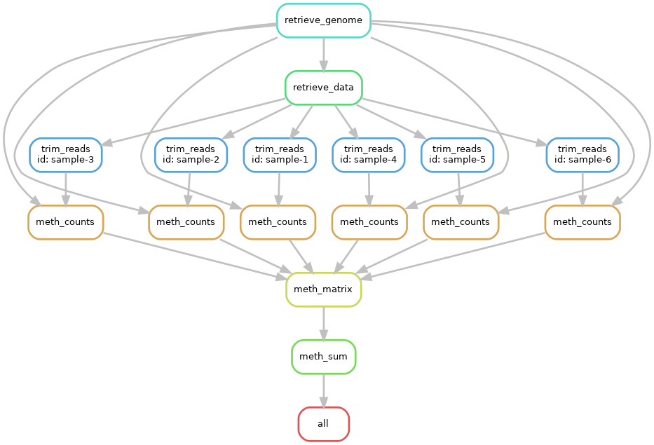

## Snakemake example for toy methyl-seq analysis

Aims to demonstrate roughly how a snakemake pipeline
could be set up for methyl-seq analysis.



## Three ways to run the pipeline

1. using mamba,  [setup instructions](../minimal/readme-mamba.md)
   same as for 'minimal' example

```
snakemake --snakefile Snakefile --configfile=config/mamba.yaml all
```

2. using apptainer containers,  [setup instructions](../minimal/readme-apptainer.md)
   same as for 'minimal' example but creating image file
   `r_methylseq.sif` instead of `r_minimial.sif`

```
snakemake --snakefile Snakefile --configfile=config/apptainer.yaml all
```

3. on a slurm cluster, [setup instructions](../minimal/readme-slurm.md)
   same as for 'minimal' example

```
module load languages/python/3.12.3
module load apptainer/1.3.1
snakemake --snakefile Snakefile --configfile=config/bc4.yaml all
```

## Cleanup

```
rm -rf example-results
rm -rf /tmp/snakemake-example-methylseq-data
rm r_methylseq.{tar,sif}
```

## Contents

- [Snakefile](Snakefile) pipeline instructions

- [rules/](rules) snakemake rules loaded by [Snakefile](Snakefile)

- [docker/Dockerfile_r](docker/Dockerfile_r) script for generating a docker image that can run R

- [scripts/](scripts) toy scripts run by the pipeline

- [config/](config) snakemake configuration files for the different ways of running the pipeline


