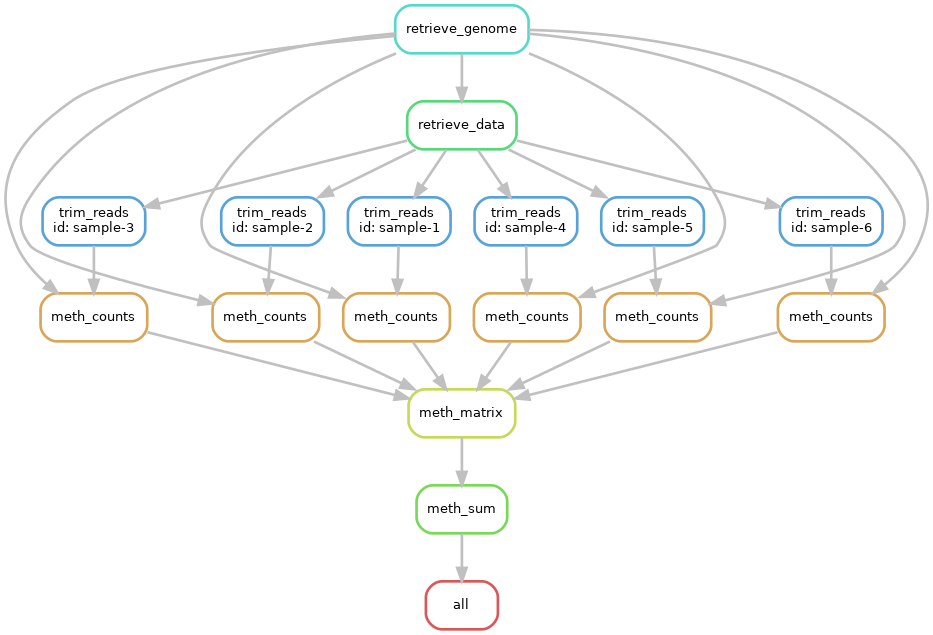

## Snakemake example for toy methyl-seq data

Aims to demonstrate roughly how a snakemake pipeline
could be set up for methyl-seq data.




### Installation

Ensure that [Miniforge](https://github.com/conda-forge/miniforge) is installed, e.g. for linux

```
curl -L -O "https://github.com/conda-forge/miniforge/releases/latest/download/Miniforge3-$(uname)-$(uname -m).sh"
bash Miniforge3-$(uname)-$(uname -m).sh
export PATH="~/miniforge3/bin:$PATH"
mamba init
## logout 
## login
export PATH="~/miniforge3/bin:$PATH"
mamba activate ~/miniforge3
```

The original mamba environment was created as follows:

```
mamba create --name "snakemake_example" python=3.12
mamba activate snakemake_example
pip3 install snakemake
pip3 install python-dotenv
mamba install conda-forge::r-base
conda env export --from-history > mamba.yml
```

It can be recreated using [mamba.yml](mamba.yml).

```
mamba env create -n snakemake_example -f mamba.yml
```

### Running the pipeline

Perform all steps in the pipeline
```
mamba activate snakemake_example
snakemake all -np ## dry run
snakemake all     ## full run
snakemake --dag all | dot -Tpng > dag.png ## visualize 
```

###  Useful info

Reference:
https://snakemake.readthedocs.io/en/stable/

Nice example:
https://github.com/ccbskillssem/snakemake_fa23/

### Learning 

https://snakemake.readthedocs.io/en/stable/tutorial/basics.html

1. Creating and applying simple rules
2. Generalizing with wildcards
3. Sequence of two rules
4. Rule with list of inputs
5. Complex DAG
6. Target rule

https://snakemake.readthedocs.io/en/stable/tutorial/advanced.html
1. Config file
2. Parameters
3. Threads
4. Logging
5. Temporary files

https://snakemake.readthedocs.io/en/stable/tutorial/additional_features.html
1. Modularization
2. Software dependencies
3. Containerizing
4. SLURM


### TODO

* Add containerization
* Add slurm


